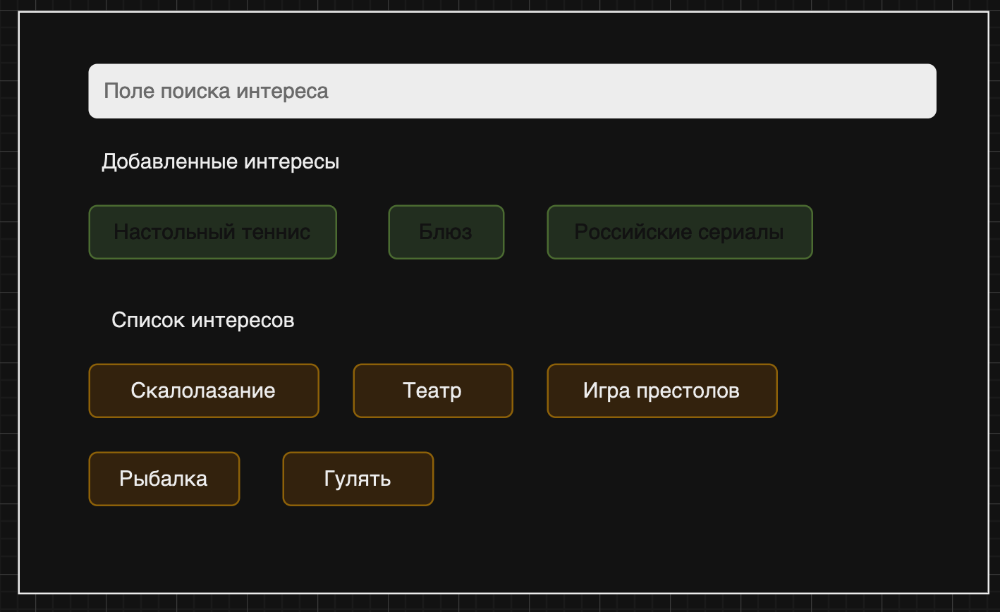
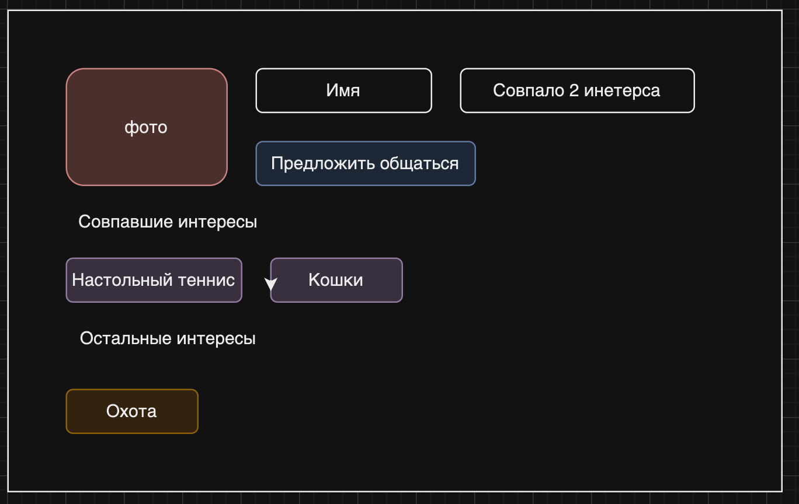

# ok-dating

Выпускной проект курса
[Kotlin Backend Developer](https://otus.ru/lessons/kotlin/?int_source=courses_catalog&int_term=programming).
на тему "Романтические знакомства  (анкеты)"

Знакомства по общим интересам. Пользователи составляют свой список интересов, 
и им подбираются анкеты с наибольшим совпадением интересов.

## Визуальная схема фронтенда

Выбор интересов при заполнении профиля

Анкета пользователя

## MVP проекта

### Данные анкеты: 

Имя, пол, описание, интересы, и контакт для связи.

Контакт становится видимым только в случае согласия на общение.

### Функционал

- Создание своей анкеты.
- Просмотр анкет других пользователей.
- Предложение и согласие на общение с раскрытием контактов.

## Сущности

[Целевая аудитория](./docs/04-architecture/03-api.md)

## Документация

1. [Целевая аудитория](./docs/01-marketing/01-target-audience.md)

